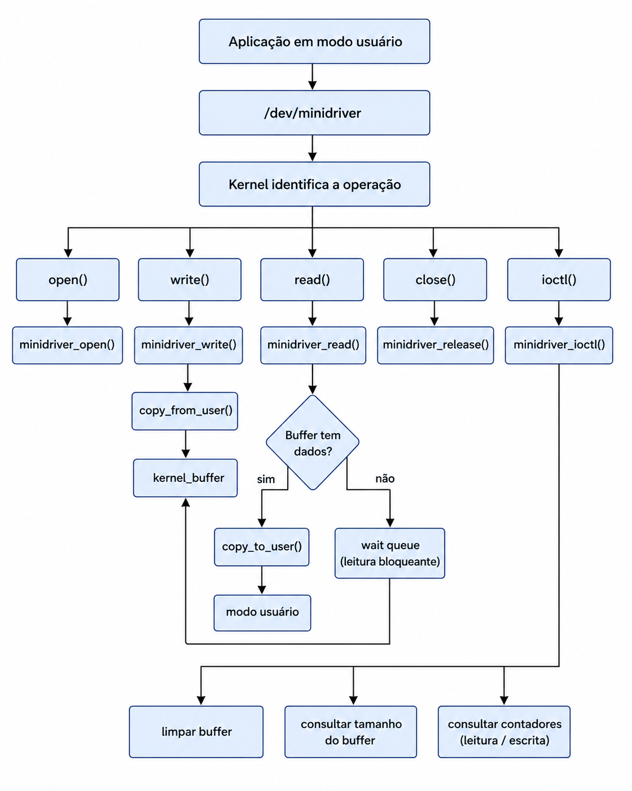

# Trabalho de Sistemas Operacionais

## Integrantes da Equipe

* Lucas Teixeira Holanda
* Lucas Martins Menezes
* João Victor de Abreu
* João Victor Marques Falcão

# Introdução

Este projeto consiste no desenvolvimento de um driver de caractere virtual para o sistema operacional Linux, implementado em linguagem C como um módulo do kernel. O objetivo é demonstrar, de forma prática, o funcionamento de um device driver e a comunicação entre aplicações executadas em modo usuário (*user space*) e o kernel (*kernel space*).

O driver cria um dispositivo virtual acessível através do diretório `/dev`, permitindo que aplicações realizem operações de leitura, escrita e controle utilizando chamadas de sistema como `open()`, `read()`, `write()`, `close()` e `ioctl()`. Diferentemente de um driver associado a um dispositivo físico, este projeto implementa um dispositivo inteiramente em software, utilizando um buffer interno localizado na memória do kernel.

Além das operações básicas de leitura e escrita, o projeto implementa comandos de controle utilizando `ioctl()` e um mecanismo de wait queue, permitindo que processos que tentem realizar uma leitura quando o buffer estiver vazio permaneçam bloqueados até que novos dados sejam escritos no dispositivo.

# Objetivos

O principal objetivo deste projeto é compreender o funcionamento de um driver de dispositivo no sistema operacional Linux por meio da implementação de um driver de caractere virtual.

Como objetivos específicos, destacam-se:

* Desenvolver um módulo carregável do kernel (`minidriver.ko`);
* Criar dinamicamente um dispositivo de caractere em `/dev/minidriver`;
* Implementar as operações `open()`, `read()`, `write()`, `release()` e `ioctl()`;
* Implementar comunicação segura entre o espaço de usuário e o espaço do kernel;
* Implementar a wait queue;
* Compreender o fluxo de comunicação entre aplicações e o kernel Linux.

---

# Arquitetura Geral do Projeto

A Figura 1 apresenta a arquitetura geral do sistema e o fluxo de comunicação entre as aplicações em modo usuário e o driver implementado no kernel Linux.

    
     
    <em>Figura 1 – Arquitetura geral do MiniDriver.</em>

O fluxo de funcionamento ocorre da seguinte forma:

1. Uma aplicação em modo usuário realiza uma chamada de sistema.
2. O kernel identifica que a operação está sendo realizada sobre o dispositivo `/dev/minidriver`.
3. A chamada é encaminhada para a função correspondente implementada no driver.
4. O driver processa a operação utilizando seu buffer interno localizado na memória do kernel.
5. Quando necessário, os dados são transferidos entre os espaços de memória.
6. Caso uma leitura seja solicitada enquanto o buffer estiver vazio, o processo permanece bloqueado na **wait queue** até que novos dados sejam escritos no dispositivo.

# Descrição do Projeto

O MiniDriver foi desenvolvido como um **driver de caractere virtual**, executado em modo kernel por meio de um módulo carregável.

Após ser compilado, o módulo é carregado no kernel Linux e registra um dispositivo de caractere, criando automaticamente o arquivo especial:
/dev/minidriver

Esse arquivo funciona como a interface de comunicação entre aplicações em modo usuário e o driver executado no kernel.

O driver implementa as seguintes operações:

* `open()` — abertura do dispositivo;
* `read()` — leitura dos dados armazenados;
* `write()` — escrita de dados no buffer interno;
* `release()` — fechamento do dispositivo;
* `ioctl()` — execução de comandos de controle.

Internamente, o driver mantém um buffer localizado na memória do kernel para armazenamento dos dados recebidos, além de variáveis responsáveis pelo gerenciamento do dispositivo e pelas estatísticas de utilização.

Também foi implementado um mecanismo de **wait queue**, permitindo que chamadas de leitura permaneçam bloqueadas enquanto não houver dados disponíveis, comportamento semelhante ao observado em diversos drivers reais do Linux.

# Testes Realizados

Para validar o funcionamento do driver, foram realizados testes envolvendo todas as funcionalidades implementadas.

Inicialmente verificou-se o carregamento correto do módulo no kernel e a criação automática do dispositivo `/dev/minidriver`.

Em seguida foram realizados testes de escrita e leitura utilizando aplicações padrão do Linux e programas desenvolvidos em linguagem C, validando a comunicação entre o espaço de usuário e o espaço do kernel.

Também foram testados os comandos implementados através de `ioctl()`, verificando corretamente:

* limpeza do buffer;
* consulta do tamanho atual do buffer;
* quantidade de leituras realizadas;
* quantidade de escritas realizadas.

Por fim, foi validado o funcionamento da wait queue, demonstrando que uma chamada de leitura permanece bloqueada quando o buffer está vazio e é automaticamente liberada após uma operação de escrita disponibilizar novos dados.

As mensagens registradas pelo driver através de `printk()` também foram verificadas no log do kernel, permitindo acompanhar todas as operações executadas pelo módulo.

# Uso de IA no Projeto

Durante o desenvolvimento do projeto, a Inteligência Artificial foi utilizada como apoio para estudo e esclarecimento de conceitos.

A IA auxiliou principalmente na compreensão de temas relacionados a módulos do kernel, device drivers e as chamadas de sistemas, como os seus parametros e como fazer uma conexão segura entre o modo usuário e o modo kernel do linux sem compremeter o funcionamento do meu dispositivo.

Apesar desse apoio, a implementação foi analisada, testada e ajustada pela equipe, que ficou responsável por compreender o funcionamento do código, executar os testes no ambiente Linux e validar o comportamento do driver.
